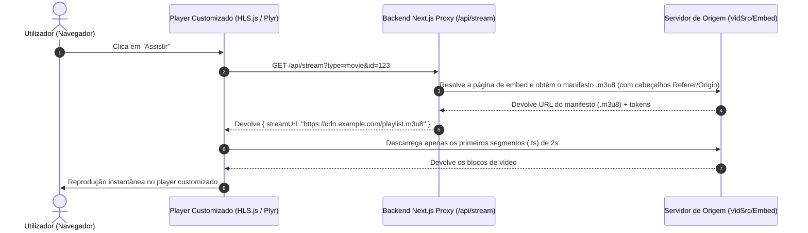

# Plano Futuro: Extração de Stream HLS (.m3u8) & Player Próprio Customizado

Este documento serve como plano arquitetural de referência para a futura substituição dos leitores `iframe` de terceiros (como o VidSrc) por um **player de vídeo 100% próprio e customizado**, utilizando fluxos de vídeo diretos no formato **HLS (`.m3u8`)**.

---

## 1. Porquê Implementar esta Funcionalidade?

### Benefícios Principais:
1. **Design & Identidade Visual Única**:
   * Controlo total sobre o design do player (barras de progresso, estilo de botões de volume, ícones, fontes, cores com o tema do **NAIPE+**).
   * **Remoção de marcas de água**: Eliminação de marcas de água de terceiros (ex: texto `vidsrc`).
2. **Eliminação de Anúncios e Pop-ups**:
   * Os leitores `iframe` de terceiros trazem frequentemente redirecionamentos e publicidade. Com o fluxo `.m3u8` num player próprio, os anúncios são 100% ignorados.
3. **Experiência de Utilizador Premium**:
   * Suporte para memorização automática do progresso do vídeo, seleção de velocidade de reprodução (0.5x a 2x), atalhos de teclado customizados e suporte limpo para legendas em Português (`.vtt` / `.srt`).
4. **Reprodução Instantânea**:
   * O formato HLS (`.m3u8`) transmite o vídeo em pequenos segmentos (2-4 segundos). O vídeo arranca instantaneamente em < 1 segundo sem descarregar o ficheiro completo.

---

## 2. Como Funciona a Arquitetura Tecnológica



### O que é o `.m3u8`?
* É um ficheiro de texto indexador (com menos de 10 KB) que contém a lista de links para pequenos pedaços de vídeo de 2 a 4 segundos (ficheiros `.ts` ou `.m4s`).
* **Zero Armazenamento no Servidor**: O seu servidor Next.js **nunca armazena nem descarrega o filme**. Apenas descobre o link da lista e passa-o ao navegador. O tráfego pesado de vídeo vai direto dos servidores da CDN para o ecrã do utilizador.

---

## 3. Passo a Passo da Implementação Futura

### Passo 1: Dependências do Frontend
Instalar o motor HLS e o player customizado:
```bash
npm install hls.js plyr-react
```

### Passo 2: Rota Resolver Proxy no Backend Next.js (`src/app/api/stream/route.ts`)
Criar um endpoint seguro que faça o *scraping* / parsing do link `.m3u8` a partir dos servidores de origem, adicionando os cabeçalhos HTTP exigidos (`Referer`, `User-Agent`, `Origin`):

* **Função**: Descodificar o HTML do servidor de origem e extrair o link do manifesto `.m3u8`.
* **Segurança**: Mascarar os cabeçalhos para evitar bloqueios de CORS.

### Passo 3: Componente de Player Customizado (`src/components/CustomVideoPlayer.tsx`)
Criar o componente de player de vídeo utilizando o **Plyr** ou **Video.js** integrado com o **HLS.js**:
* Personalização visual com classes do Tailwind CSS.
* Controlos de volume, ecrã inteiro, barra de tempo fluida e atalhos de teclado (`Espaço` para Pausa, `F` para Ecrã Inteiro, `M` para Mute).

### Passo 4: Mecanismo de Salvaguarda (*Fallback*)
Caso a extração de um determinado filme/série falhe ou a origem altere as suas encriptações:
* O leitor faz uma alternância automática inteligente para o modo `iframe` original como salvaguarda para garantir que o utilizador consegue **sempre** assistir ao conteúdo.

---

## 4. Desafios & Soluções Técnicas

| Desafio | Causa | Solução |
| :--- | :--- | :--- |
| **Bloqueios de CORS** | O servidor da CDN rejeita pedidos de domínios externos no browser | A rota API do Next.js faz o *proxy* dos cabeçalhos HTTP (`Referer`/`Origin`) |
| **Tokens Temporários** | Os links `.m3u8` expiram após alguns minutos | O resolver gera a URL de transmissão em tempo real quando o utilizador clica em "Assistir" |
| **Alteração de Algoritmo** | Os provedores alteram a estrutura de encriptação | Manter o sistema de *fallback* para `iframe` ativo para alternância instantânea |

---

> **Nota**: Este plano pode ser ativado a qualquer momento no futuro sem impacto na estrutura atual do projeto.
